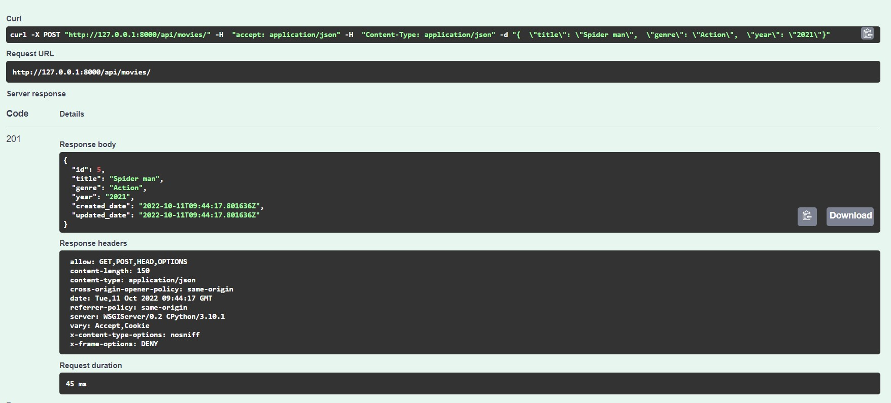
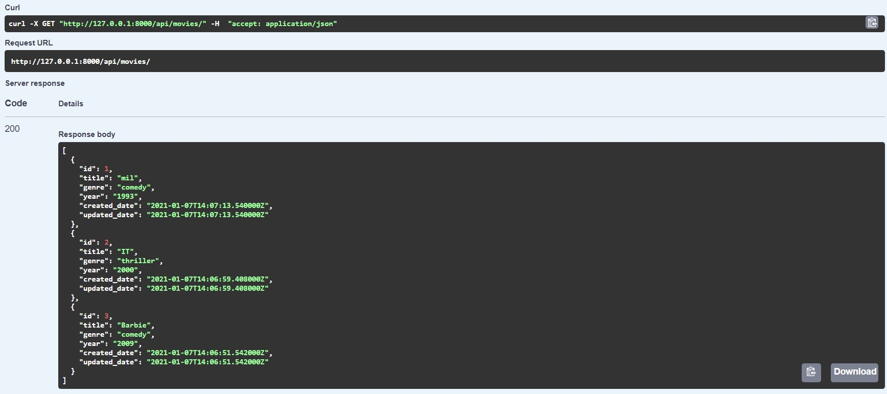
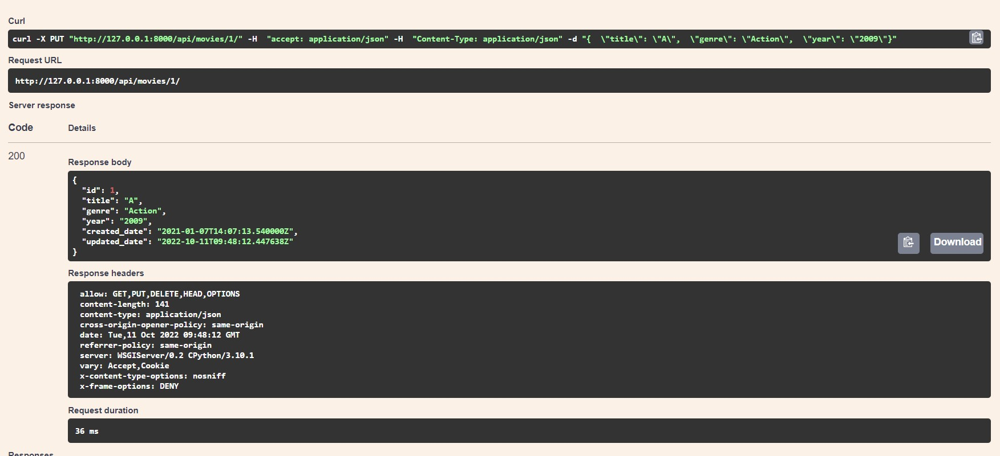
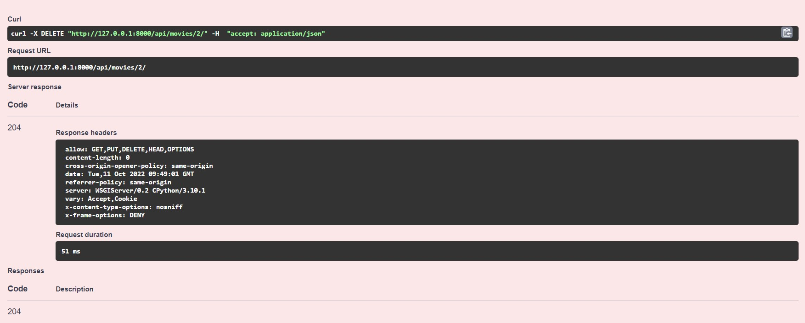
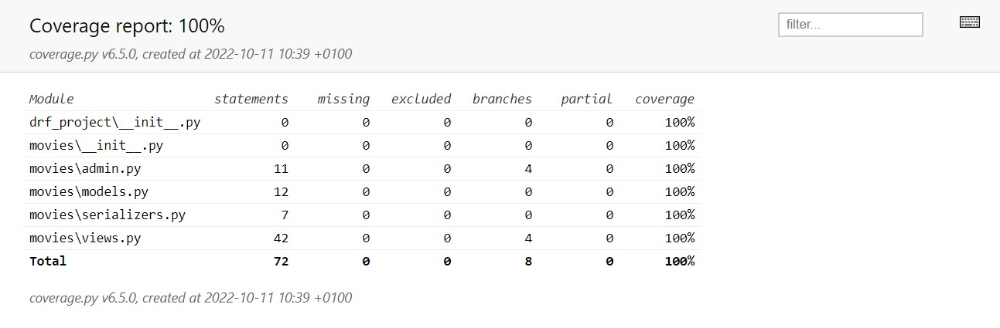

# Movie API 


Movie API is a project that has different API endpoints that allows users to store their favourite movies.

### Create 



### Read

- Getting a movie using the relevant id.


- Getting a list of movies.



### Update



### Delete



## Testing 


Using Pytest as a way for Test Driven Development. 

Managed to reach 100% on code coverage.



## Installation & Run the program


1. Create and activate python virtual environment. 

2. Use pip to install the project

```bash
pip install -r requirements.txt
```

3. Start the server
```bash
python manage.py runserver
```

## Built With

- Python
- Django
- Django Rest Framework
- Docker
- Docker Compose
- Pytest

**Code Coverage & Code Quality**

- Coverage.py 
- Flakes

**API Documentations**

- Swagger
- Core API
